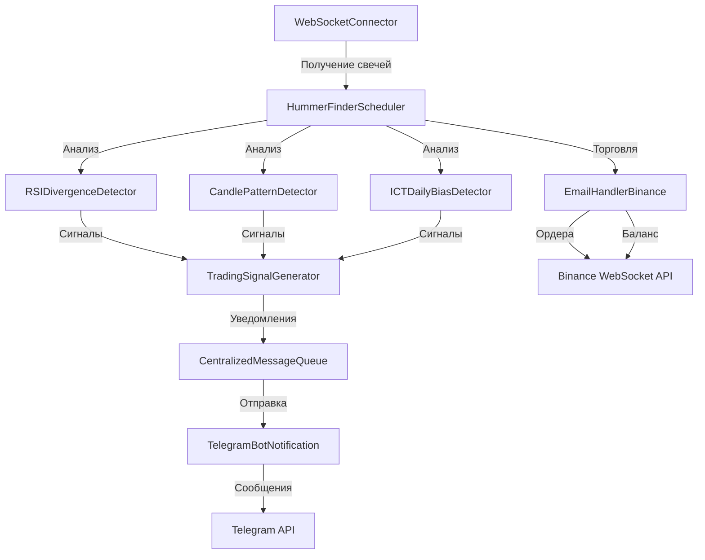

# Полный анализ Telegram Trading Bot

## Оглавление
1. [Обзор проекта](#обзор-проекта)
2. [Архитектура системы](#архитектура-системы)
3. [Торговые стратегии](#торговые-стратегии)
4. [Telegram Bot функциональность](#telegram-bot-функциональность)
5. [Интеграции с биржами](#интеграции-с-биржами)
6. [Компоненты системы](#компоненты-системы)
7. [Конфигурация](#конфигурация)

---

## Обзор проекта

**Название проекта:** Arbitrage Trading Bot  
**Тип:** Spring Boot приложение на Java 17  
**Основное назначение:** Telegram бот для мониторинга криптовалютных рынков и генерации торговых сигналов на основе технического анализа

### Технологический стек
- **Framework:** Spring Boot 2.7.18
- **Язык:** Java 17
- **Telegram API:** telegrambots-spring-boot-starter 6.8.0, java-telegram-bot-api 6.9.1
- **Биржи:** 
  - Binance (binance-connector-java 3.2.0)
  - MEXC (xchange-mexc 5.1.0)
- **WebSocket:** OkHttp 4.9.2
- **Визуализация:** JFreeChart 1.5.4, XChart 3.8.5

---

## Архитектура системы

### Основные компоненты

```
ArbitrageApplication (Main)
├── Telegram Bot (telegram/)
│   ├── TelegramBotStarter883 - основной бот
│   ├── TelegramBotNotification - система уведомлений
│   └── CentralizedMessageQueue - очередь сообщений
├── Scheduler (scheduler/)
│   ├── TradingSignalGenerator - генератор сигналов
│   ├── EmailHandlerBinance - обработчик Binance
│   └── EmailHandlerMexc - обработчик MEXC
├── Hummer Finder (hummer/)
│   └── HummerFinderScheduler - планировщик поиска паттернов
├── Util (util/)
│   ├── RSIDivergenceDetector - детектор дивергенции RSI
│   ├── CandlePatternDetector - детектор свечных паттернов
│   ├── ICTDailyBiasDetector - детектор дневного смещения
│   └── Indicators - технические индикаторы
├── WebSocket (websocket/)
│   └── WebSocketConnector - подключения к биржам
└── Model (model/)
    └── Candle - модель свечи
```

### Поток данных

```
WebSocket → Получение свечей → Анализ стратегиями → Генерация сигналов → Telegram уведомления
```

---

## Торговые стратегии

Бот реализует **3 основные торговые стратегии**:

### 1. RSI Divergence Strategy (Стратегия дивергенции RSI)

#### Описание
Стратегия основана на обнаружении дивергенций между ценой и индикатором RSI (Relative Strength Index). Дивергенция возникает, когда цена и RSI движутся в противоположных направлениях, что может сигнализировать о развороте тренда.

#### Компоненты
- **Класс:** `RSIDivergenceDetector`
- **Метод расчета RSI:** `calculateRSI(List<Candle> candles, int period)`
- **Период RSI:** По умолчанию 14 (настраиваемый)

#### Логика работы

1. **Расчет RSI:**
   - Используется стандартная формула RSI с экспоненциальным сглаживанием
   - Период по умолчанию: 14 свечей
   - Формула: `RSI = 100 - (100 / (1 + RS))`, где `RS = средний рост / среднее падение`

2. **Поиск пивотов (Pivot Points):**
   - **Pivot Lows:** Находятся через `findPivotLows()` - точки, где RSI ниже соседних значений
   - **Pivot Highs:** Находятся через `findPivotHighs()` - точки, где RSI выше соседних значений
   - Параметры поиска: `leftBars` и `rightBars` (по умолчанию 5)

3. **Обнаружение дивергенций:**

   **Бычья дивергенция (Bullish Divergence):**
   - Цена формирует более низкие минимумы (lower lows)
   - RSI формирует более высокие минимумы (higher lows)
   - Сигнал на покупку

   **Медвежья дивергенция (Bearish Divergence):**
   - Цена формирует более высокие максимумы (higher highs)
   - RSI формирует более низкие максимумы (lower highs)
   - Сигнал на продажу

4. **Параметры фильтрации:**
   - `minCandlesBetweenPivots`: Минимальное расстояние между пивотами (по умолчанию 5)
   - `maxCandlesBetweenPivots`: Максимальное расстояние между пивотами (по умолчанию 60)

#### Условия входа

**Сигнал на покупку (BUY):**
- Обнаружена бычья дивергенция RSI
- Дивергенция подтверждена между двумя валидными пивотами
- Расстояние между пивотами в допустимом диапазоне

**Сигнал на продажу (SELL):**
- Обнаружена медвежья дивергенция RSI
- Дивергенция подтверждена между двумя валидными пивотами
- Расстояние между пивотами в допустимом диапазоне

#### Интеграция
- Используется в `HummerFinderScheduler.detectRsiDivergences()`
- Проверяется на таймфреймах: 1h, 4h, 1d, 1w
- Уведомления отправляются через Telegram

---

### 2. Super Engulfing Strategy (Стратегия супер поглощения)

#### Описание
Стратегия основана на обнаружении свечного паттерна "Engulfing" (поглощение) с дополнительными фильтрами для повышения качества сигналов. Паттерн Engulfing возникает, когда тело одной свечи полностью поглощает тело предыдущей свечи противоположного цвета.

#### Компоненты
- **Класс:** `CandlePatternDetector`
- **Методы:**
  - `detectSuperEngulfing()` - базовое обнаружение
  - `detectSuperEngulfing2X()` - с дополнительной проверкой фитиля
  - `detectSuperEngulfing3X()` - тройное поглощение

#### Логика работы

1. **Базовый паттерн Engulfing:**

   **Бычий Engulfing (Bullish Engulfing):**
   - Первая свеча: медвежья (красная)
   - Вторая свеча: бычья (зеленая)
   - Тело второй свечи полностью поглощает тело первой
   - Низ второй свечи ниже низа первой свечи
   - Закрытие второй свечи выше открытия первой свечи

   **Медвежий Engulfing (Bearish Engulfing):**
   - Первая свеча: бычья (зеленая)
   - Вторая свеча: медвежья (красная)
   - Тело второй свечи полностью поглощает тело первой
   - Верх второй свечи выше верха первой свечи
   - Закрытие второй свечи ниже открытия первой свечи

2. **Super Engulfing 2X:**
   - Все условия базового Engulfing
   - Дополнительно: фитиль текущей свечи должен быть в 3 раза больше тела предыдущей свечи
   - Проверка через `isWick3XLargerThanPreviousBody()`

3. **Super Engulfing 3X:**
   - Требует 3 свечи подряд
   - Первая и третья свечи одного типа (обе бычьи или обе медвежьи)
   - Вторая свеча противоположного типа
   - Первая свеча поглощает вторую
   - Вторая свеча поглощает третью
   - Проверка последовательности поглощений

#### Условия входа

**Сигнал на покупку (BUY):**
- Обнаружен бычий Super Engulfing паттерн
- Для 1h таймфрейма: RSI должен быть в диапазоне 40-60 (нейтральная зона)
- Паттерн подтвержден на последних свечах

**Сигнал на продажу (SELL):**
- Обнаружен медвежий Super Engulfing паттерн
- Для 1h таймфрейма: RSI должен быть в диапазоне 40-60
- Паттерн подтвержден на последних свечах

#### Дополнительные фильтры
- **Kill Zone:** Проверка времени торговли (17:00-20:00 по времени Еревана)
- **RSI фильтр:** Для 1h таймфрейма требуется RSI в диапазоне 40-60
- **Временные ограничения:** Анализ только в определенные часы (10:00-21:00)

#### Интеграция
- Используется в `HummerFinderScheduler.detectEngulfing()`
- Проверяется на таймфреймах: 1h, 4h, 1d, 1w
- Отправка уведомлений с графиками через Telegram

---

### 3. ICT Daily Bias Strategy (Стратегия дневного смещения ICT)

#### Описание
Стратегия основана на концепции ICT (Inner Circle Trader) для определения дневного смещения рынка (Daily Bias). Bias определяет общее направление рынка на день и помогает принимать торговые решения в правильном направлении.

#### Компоненты
- **Класс:** `ICTDailyBiasDetector`
- **Методы:**
  - `detectDailyBias(Candle previousDay, Candle currentDay)` - для двух свечей
  - `detectDailyBias(List<Candle> candles, ZoneId zoneId)` - для списка свечей
  - `detectDailyBias(List<Candle> candles)` - с UTC временной зоной

#### Логика работы

1. **Агрегация дневных свечей:**
   - Система группирует свечи меньших таймфреймов в дневные свечи
   - Объединяет High, Low, Volume, QuoteVolume
   - Использует Close последней свечи дня

2. **Определение Bias:**

   **Bullish Daily Bias (Бычье смещение):**
   - Закрытие предыдущего дня выше максимума предыдущего дня
   - Ожидание: текущая свеча коснется более высокого дневного уровня
   - Сигнал: покупка на откатах

   **Bearish Daily Bias (Медвежье смещение):**
   - Закрытие предыдущего дня ниже минимума предыдущего дня
   - Ожидание: текущая свеча коснется более низкого дневного уровня
   - Сигнал: продажа на отскоках

   **Ranging Daily Bias (Боковое смещение):**
   - Закрытие предыдущего дня между High и Low
   - Нет четкого направления
   - Ожидание: движение в любую сторону

   **Unknown Bias:**
   - Недостаточно данных для анализа
   - Требуется ручной анализ

3. **Алгоритм определения:**

```java
if (previousClose < previousLow) {
    bias = BEARISH;
    message = "Bearish Daily Bias\nWe expect today's candle to touch lower daily level";
} else if (previousClose > previousHigh) {
    bias = BULLISH;
    message = "Bullish Daily Bias\nWe expect today's candle to touch higher daily level";
} else if (previousClose > previousLow && previousClose < previousHigh) {
    bias = RANGING;
    message = "Ranging Daily Bias\nNo expectation where the market is likely to go";
} else {
    bias = UNKNOWN;
    message = "Code couldn't analyze the chart\nManual analysis is required";
}
```

#### Условия входа

**Сигнал на покупку (BUY):**
- Определен Bullish Daily Bias
- Торговля в направлении смещения
- Вход на откатах к поддержке

**Сигнал на продажу (SELL):**
- Определен Bearish Daily Bias
- Торговля в направлении смещения
- Вход на отскоках к сопротивлению

#### Требования к данным
- Минимум 3 дневные свечи для анализа
- Текущий день должен начаться
- Временная зона: UTC или настраиваемая (по умолчанию Asia/Yerevan)

#### Интеграция
- Используется в `HummerFinderScheduler` для анализа дневных и недельных таймфреймов
- Результаты включаются в уведомления Telegram
- Работает совместно с другими ICT компонентами (Order Blocks, FVG)

---

## Telegram Bot функциональность

### Основной класс
**TelegramBotStarter883** - основной класс бота, наследуется от `TelegramLongPollingBot`

### Имя бота
- **Username:** `ArbirtajeBot` (опечатка в коде, должно быть ArbitrageBot)

### Функции бота

1. **Обработка обновлений:**
   - `onUpdateReceived(Update update)` - обработка входящих сообщений
   - `onUpdatesReceived(List<Update> updates)` - пакетная обработка

2. **Система уведомлений:**
   - `TelegramBotNotification` - централизованная система отправки уведомлений
   - `CentralizedMessageQueue` - очередь сообщений для предотвращения спама

3. **Типы уведомлений:**
   - Текстовые уведомления о сигналах
   - Уведомления с графиками свечей
   - Уведомления об ошибках
   - Уведомления о статусе торговли

### Telegram Chat IDs
Бот отправляет сообщения в следующие чаты:
- `693346032` - основной чат
- `264698888` - дополнительный чат
- `861458389` - чат для сигналов
- `-1003449314606` - групповой чат

### Формат сообщений

**Шаблон сообщения** (из `messageTemplate.txt`):
```
<strong>%s</strong>
spred: %s

<strong>Buy exchange</strong>
name: <strong>%s</strong>
price: %s
network: %s

<strong>Sell exchange</strong>
name: <strong>%s</strong>
price: %s
network: %s
```

**Примеры сообщений:**
- "Super Engulfing_1h BTCUSDT"
- "RSI Divergence detected on 4h"
- "Bullish Daily Bias\nWe expect today's candle to touch higher daily level"

---

## Интеграции с биржами

### Binance Integration

#### API подключение
- **WebSocket API Client:** `WebSocketApiClient` из binance-connector-java
- **Типы подключений:**
  - Market Data WebSocket - получение свечей и тикеров
  - Account WebSocket - информация о балансе
  - Order WebSocket - управление ордерами

#### Функциональность
1. **Получение свечей:**
   - Подписка на kline (свечные данные)
   - Обработка через `processCandlesData()`
   - Хранение в `List<Candle>`

2. **Торговля:**
   - Размещение ордеров через WebSocket API
   - Типы ордеров: LIMIT, MARKET
   - Символ по умолчанию: BTCUSDT
   - Комиссия: 0.1% (COMMISSION_RATE = 0.001)

3. **Управление балансом:**
   - Получение баланса через `getBalance(asset)`
   - Отслеживание BTC и USDT балансов
   - Автоматическое обновление после сделок

#### Логика торговли (EmailHandlerBinance)

**Условия покупки:**
- RSI в определенном диапазоне
- Проверка через `shouldBuy()`
- Использование Heikin Ashi свечей
- Расчет ATR (Average True Range)
- XATR Trailing Stop

**Условия продажи:**
- Проверка через `shouldSellMyVersion2()`
- Учет прибыли и времени удержания
- Минимальная прибыль: 0.5% для длительных позиций
- Минимальная прибыль: 1% для коротких позиций

### MEXC Integration

#### API подключение
- **XChange Library:** xchange-mexc 5.1.0
- **Email Handler:** `EmailHandlerMexc` - обработчик сигналов от MEXC

#### Функциональность
- Получение данных о ценах
- Арбитражные возможности между Binance и MEXC
- Обработка email уведомлений (если используется)

### WebSocket Connector

**Класс:** `WebSocketConnector`

**Функции:**
- Управление WebSocket подключениями
- Автоматический ping для поддержания соединения
- Подписка/отписка от потоков данных
- Обработка переподключений

**Методы:**
- `connect(String url)` - подключение
- `subscribe(String message)` - подписка на поток
- `startPing(long interval)` - запуск ping
- `close()` - закрытие соединения

---

## Компоненты системы

### 1. HummerFinderScheduler

**Назначение:** Главный планировщик для анализа рынка и генерации сигналов

**Основные методы:**
- `init()` - инициализация подключений
- `yyy(List<Candle> candles, String symbol)` - обработка свечей (название метода с опечаткой)
- `detectEngulfing()` - обнаружение Engulfing паттернов
- `detectRsiDivergences()` - обнаружение RSI дивергенций
- `detectHammer()` - обнаружение паттерна "молот"
- `analyzeRSIAndConsolidationBreakout()` - анализ RSI и прорывов консолидации

**Таймфреймы:**
- 5m, 15m, 1h, 4h, 1d, 1w

**Символы:**
- Загружаются из `Symbols.json`
- Поддержка множественных символов

### 2. TradingSignalGenerator

**Назначение:** Генерация торговых сигналов на основе технических индикаторов

**Методы:**
- `calculateSignals()` - основной метод расчета сигналов
- `calculateHeikinAshi()` - расчет Heikin Ashi свечей
- `calculateATR()` - расчет Average True Range
- `calculateXATRTrailingStop()` - расчет trailing stop на основе ATR

**Типы сигналов:**
- `BUY` - сигнал на покупку
- `SELL` - сигнал на продажу
- `NONE` - нет сигнала

### 3. Indicators

**Назначение:** Утилитный класс для расчета технических индикаторов

**Методы:**
- `calculateRSI(List<Candle> candles, int period)` - расчет RSI
  - Период по умолчанию: 14
  - Использует экспоненциальное сглаживание
  - Возвращает значение от 0 до 100

### 4. CandlePatternDetector

**Назначение:** Обнаружение свечных паттернов

**Методы:**
- `isBullish(Candle candle)` - проверка бычьей свечи
- `isBearish(Candle candle)` - проверка медвежьей свечи
- `detectSuperEngulfing()` - обнаружение базового Engulfing
- `detectSuperEngulfing2X()` - Engulfing с проверкой фитиля
- `detectSuperEngulfing3X()` - тройное поглощение
- `calculateTopWick()` - расчет верхнего фитиля
- `calculateBottomWick()` - расчет нижнего фитиля

### 5. Model Classes

**Candle:**
- `open`, `high`, `low`, `close` - цены OHLC
- `volume`, `quoteVolume` - объемы
- `openTime`, `closeTime` - временные метки

**BuyAndSellPriceModel:**
- `buyPrice` - цена покупки (ask price)
- `sellPrice` - цена продажи (bid price)

### 6. Zones

**ConsolidationZoneCalculator:**
- Расчет зон консолидации
- Используется для определения уровней поддержки/сопротивления

### 7. Util Components

**FVGCalculator:**
- Расчет Fair Value Gaps (ICT концепция)
- Определение несправедливых ценовых разрывов

**SMCOrderBlocks:**
- Smart Money Concepts Order Blocks
- Определение зон, где крупные игроки размещали ордера

**RSIDivergenceDetector:**
- Детектор дивергенций RSI (описано выше)

**ICTDailyBiasDetector:**
- Детектор дневного смещения (описано выше)

---

## Конфигурация

### application.properties

```properties
server.port=8080

mexc.api.key=mx0vglq87pgM4t6ACF
mexc.secret.key=6592aa3b8a264b759afb619c068912e2

binance.api.key=wHq6P0IuLILEDsbB8mPEdnBf9RtSnjLQSKOxxOF04YuQqFahqRDiblcpDpDZj0mh
binance.secret.key=jQryyLGmsZ7MBaUR8Javxaq8LyrkR73VvdEK6FNFDpmR0rPQH3IGuo6JBqwiqZ4o
```

**Важно:** API ключи хранятся в открытом виде. В продакшене следует использовать переменные окружения или зашифрованное хранилище.

### Параметры стратегий

**RSI Divergence:**
- Период RSI: 14
- Минимальное расстояние между пивотами: 5 свечей
- Максимальное расстояние между пивотами: 60 свечей
- Left bars для пивотов: 5
- Right bars для пивотов: 5

**Super Engulfing:**
- RSI фильтр для 1h: 40-60
- Проверка фитиля: 3x размер тела предыдущей свечи
- Kill Zone время: 17:00-20:00 (Asia/Yerevan)
- Рабочее время: 10:00-21:00

**ICT Daily Bias:**
- Минимум дневных свечей: 3
- Временная зона: UTC (по умолчанию) или Asia/Yerevan

### Таймфреймы

Поддерживаемые таймфреймы:
- 5m (5 минут)
- 15m (15 минут)
- 1h (1 час)
- 4h (4 часа)
- 1d (1 день)
- 1w (1 неделя)

### Символы

Символы загружаются из `Symbols.json`. По умолчанию используется BTCUSDT.

### Telegram настройки

- Bot Username: `ArbirtajeBot`
- Chat IDs: 4 чата для уведомлений
- Topic IDs: 
  - 1h: 3814
  - 4h: 3811

---

## Диаграмма взаимодействия компонентов



---

## Заключение

Telegram Trading Bot представляет собой комплексную систему для мониторинга криптовалютных рынков и генерации торговых сигналов. Бот использует три основные стратегии:

1. **RSI Divergence** - для обнаружения разворотов тренда
2. **Super Engulfing** - для обнаружения сильных свечных паттернов
3. **ICT Daily Bias** - для определения общего направления рынка

Система интегрирована с биржами Binance и MEXC через WebSocket API, что обеспечивает получение данных в реальном времени. Все сигналы отправляются пользователям через Telegram бота с подробной информацией и графиками.

### Рекомендации по улучшению

1. **Безопасность:**
   - Вынести API ключи в переменные окружения
   - Использовать зашифрованное хранилище для секретов

2. **Обработка ошибок:**
   - Улучшить обработку исключений
   - Добавить логирование ошибок

3. **Тестирование:**
   - Добавить unit тесты для стратегий
   - Интеграционные тесты для WebSocket подключений

4. **Документация:**
   - Исправить опечатки в названиях методов (yyy → processCandles)
   - Добавить JavaDoc комментарии

5. **Производительность:**
   - Оптимизировать обработку больших объемов данных
   - Добавить кэширование результатов анализа

---

**Дата анализа:** 2024  
**Версия бота:** 0.0.1-SNAPSHOT  
**Аналитик:** AI Assistant
